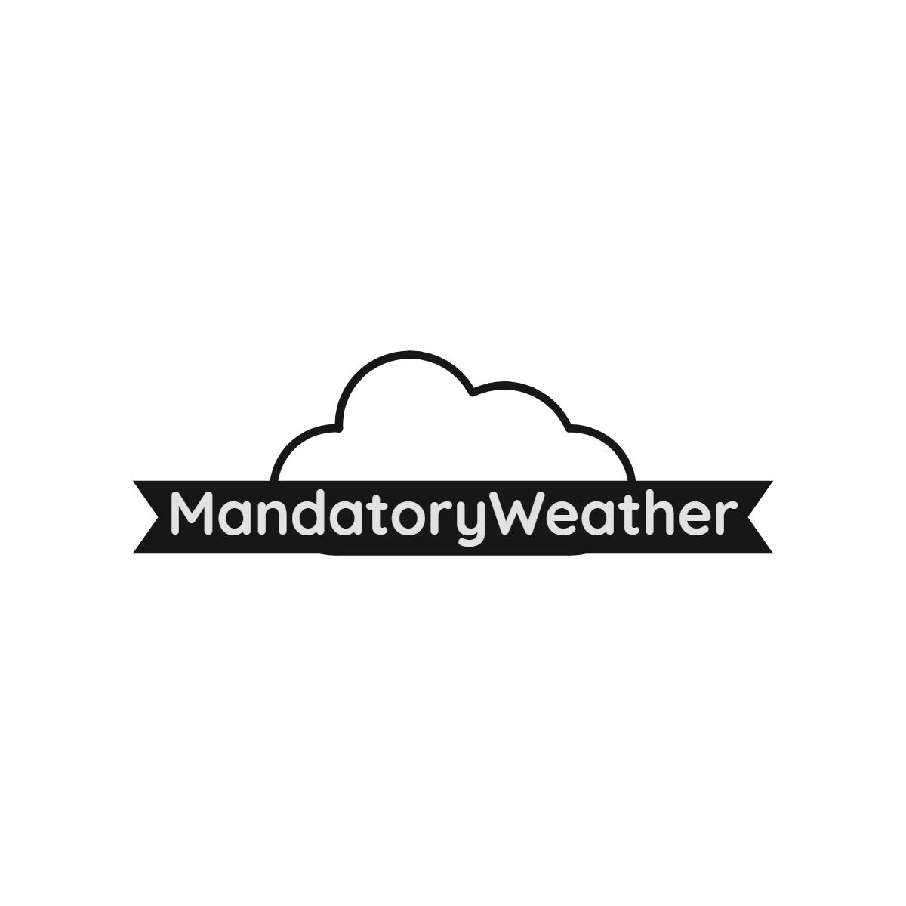

<div align="center">

  <a href="https://github.com/stanAlexandru26/Mandatory-Weather">
    
  </a>
  <br/>
  
  
  <p align="center">
    <br />
    <a href="https://mandatory-weather.netlify.app/">View Demo</a>
    ·
    <a href="https://github.com/stanAlexandru26/Mandatory-Weather/issues">Report Bug</a>
    ·
    <a href="https://github.com/stanAlexandru26/Mandatory-Weather/issues">Request Feature</a>
  </p>
</div>

<details>
  <summary>Table of Contents</summary>
  <ol>
    <li>
      <a href="#about-the-project">About The Project</a>
      <ul>
        <li><a href="#built-with">Built With</a></li>
        <li><a href="#usage">Usage</a></li>
      </ul>
    </li>
    <li>
      <a href="#components">Components</a>
      <ul>
        <li><a href="#basic-weather-card">Basic Weather Card</a></li>
        <li><a href="#forecast-weather-card">Forecast Weather Card</a></li>
        <li><a href="#weather-graph">Weather Graph</a></li>
      </ul>
    </li>
    <li><a href="#instalation">Instalation</a></li>
    <li><a href="#contributing">Contributing</a></li>
  </ol>
</details>

## About The Project

<br/>

  <div align="center"> Mandatory Weather is a weather app is a weather app that is built on top of the OpenWeatherMap API.It was designed with minimalism in mind but with maximal functionality.</div>
<br/>
<br/>


<p align="right">(<a href="#top">back to top</a>)</p>


### Built With

This section should list any major frameworks/libraries used to bootstrap your project. Leave any add-ons/plugins for the acknowledgements section. Here are a few examples.

* [React.js](https://reactjs.org/)
* [TailwindCSS](https://tailwindcss.com/)
* [Axios](https://axios-http.com/docs/intro)
* [MomentJS](https://momentjs.com/)
* [ReCharts](https://recharts.org/en-US/)
* [React-Icons](https://react-icons.github.io/react-icons/icons?name=wi)
* [OpenWeatherMapAPI](https://openweathermap.org/api)
<p align="right">(<a href="#top">back to top</a>)</p>

### Usage

1. Open the Browser
2. Go to https://mandatory-weather.netlify.app/
3. Done! or not?
4. Search for a specific location or to get the local weather just hit the pin
5. Click on Show Graph to get a advanced weather graph that has a 2 Day hourly graph or a 7 Day daily graph 

## Components

### Basic Weather Card


It's the main card of Mandatory Weather,it inclueds:
<br/>
1. The city name where the current weather is with the country name 
2. Local time inclued(Day,current time of the city,and a weather description)
3. Current Temperature in °C and the Feel like temperature
4. A Icon that showcases the weather(bases on the weather description and the day/night cycle)
5. Current Humidity (%)
6. Current Wind Speed(m/s)
7. Button to toggle the Graph component
<p align="right">(<a href="#top">back to top</a>)</p>

### Forecast Weather Card


The Forecast Card encompases a basic despription for the next 7 days
It displays the:
<br/>
1. Name of the Day
2. An Icon for the weather
3. Minumun and Maximum for the day in question
<p align="right">(<a href="#top">back to top</a>)</p>


### Weather Graph


Data!who doesnt like data?

The Weather Graph is made using ReCharts, a composable charting library built on React components.

  The X axis represent the time.
  The Y axis represents the temperature.
  Endpoints for the axes are determined by ReCharts using the minimum and the maximum of the data provided(temperature and time).
  
  There are 2 versions of the Graph,a daily and a hourly one.(daily version in the image).
  
  Daily Graph takes the same data like the Forecast Card and displays it in a easy to understand <AreaChart/>.
  
  The Hourly Graph makes use of the hourly array from the OneCall Api from OpenWeatherMap.
  There are 48 objects passed by the api which includes the UnixTime for that data entrie,current temperature an iconID and a weather description.
  All this data can be visualised when the user hovers over the Graph in a custom label.
  
<p align="right">(<a href="#top">back to top</a>)</p>


## Installation

_Below is an example of how you can instruct your audience on installing and setting up your app. This template doesn't rely on any external dependencies or services._

1. Get a free API Key at [OpenWeatherMap](https://home.openweathermap.org/users/sign_up)
2. Clone the repo
   ```sh
   git clone https://github.com/stanAlexandru26/Mandatory-Weather.git
   ```
3. Install NPM packages
   ```sh
   npm install
   ```
4. Create a `.env` file in the root directory of the app
5. Enter your OpenWeather Api key in `.env` 
   ```env
   REACT_APP_OPENWEATHER_API_KEY = ENTER YOUR API
   ```

<p align="right">(<a href="#top">back to top</a>)</p>


## Contributing

Contributions are what make the open source community such an amazing place to learn, inspire, and create. Any contributions you make are **greatly appreciated**.

If you have a suggestion that would make this better, please fork the repo and create a pull request. You can also simply open an issue with the tag "enhancement".
Don't forget to give the project a star! Thanks again!

1. Fork the Project
2. Create your Feature Branch (`git checkout -b feature/AmazingFeature`)
3. Commit your Changes (`git commit -m 'Add some AmazingFeature'`)
4. Push to the Branch (`git push origin feature/AmazingFeature`)
5. Open a Pull Request

<p align="right">(<a href="#top">back to top</a>)</p>

